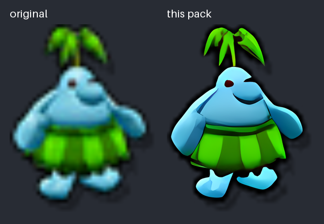
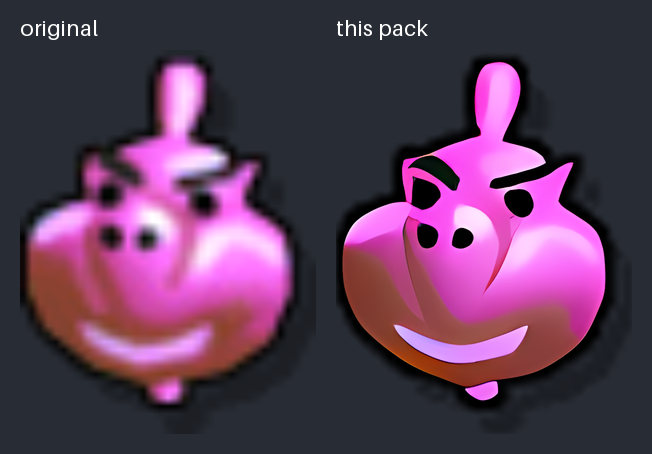
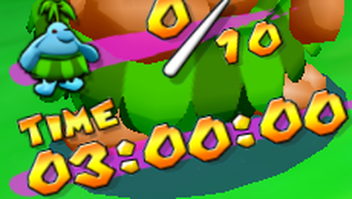

# Super Mario Sunshine HD texture extras

HD versions of Super Mario Sunshine textures that the [Super Mario Sunshine UHD Texture Pack](https://github.com/qashto/Super_Mario_Sunshine_UHD_Texture_Pack) (v2.1.1, by qashto and razius) does not cover.
They are meant to sit next to that pack, not to replace it.

They are made for the [Super Mario Sunshine PC port](https://github.com/chasem-dev/sms-pc-port), whose `tools/mods/get.py textures` (and SMS Launcher's **HD textures** setting) installs them together with the UHD pack.
They use Dolphin's custom texture format, so they also work in Dolphin.

## Textures

| Texture | Where it shows | Before / after |
| --- | --- | --- |
| `game_6/timg/monte_icon.bti` | the Pianta counter in Pianta Village's "Piantas in Need" |  |
| `game_6/timg/balloon_icon.bti` | the balloon counter in Pinna Park |  |

The Pianta counter in the PC port:



[`MISSING.csv`](MISSING.csv) lists the disc's textures that neither pack replaces yet (698 of the 1607 the game loads from files).
Many of them are greyscale effects (glows, masks, ripples) that look much the same in HD, unused leftovers (a test font, Japanese menu text, a test stage) or textures the game rewrites while running, which no pack can replace from the disc's data.

## Installing

- **PC port:** `python3 tools/mods/get.py textures` installs both packs; `python3 tools/mods/get.py extras` installs or updates only this one.
- **Dolphin:** unpack the release zip into Dolphin's `Load/Textures/` folder (it holds `GMS/...`) next to the UHD pack, and turn on **Load Custom Textures**.

## How they are made

`tools/make_textures.py` rebuilds every texture here from your own disc:

```sh
python3 tools/make_textures.py "Super Mario Sunshine.iso" --realesrgan path/to/realesrgan-ncnn-vulkan
```

Each original is upscaled 16× with [Real-ESRGAN](https://github.com/xinntao/Real-ESRGAN)'s `realesrgan-x4plus-anime` model (4×, twice), with a transparent border so its edges stay clean, then scaled to 8× with Lanczos, the scale of the UHD pack's HUD icons.
The executable and models are the official [v0.2.5.0 release](https://github.com/xinntao/Real-ESRGAN/releases/tag/v0.2.5.0).
The script names each texture the way the PC port and Dolphin look it up (`tex1_<w>x<h>_<XXH64 of the data>_<format>`) and writes a before/after picture to `previews/`.

To add a texture, add its archive and file to `TEXTURES` in `tools/make_textures.py`, run it, check the preview, and play the place it shows up in.

## Finding missing textures

`tools/audit/scan.py` lists every texture the game loads from its files that the given packs do not replace:

```sh
gcc -O2 -shared -fPIC -o tools/audit/fast.so tools/audit/fast.c   # optional, makes it ~100x faster
python3 tools/audit/scan.py "Super Mario Sunshine.iso" path/to/UHD/GMS textures --csv MISSING.csv --png missing/
```

It reads standalone images, the textures inside models and particles, and font sheets.
In a PC port run with `SMS_TEXTURE_PACK_LOG=1`, its result agreed with the port's own log for every texture used.

## Releases

`python3 tools/package.py` builds `dist/sms-hd-texture-extras-<VERSION>.zip` (the same textures always give the same zip and checksum).
The release is uploaded with `gh release create v<VERSION> dist/*.zip`, and the PC port's `tools/mods/get.py` pins its URL, size and MD5.

## Credits

The original textures are Nintendo's; these are upscales of them, for use with your own copy of the game.
Upscaling by [Real-ESRGAN](https://github.com/xinntao/Real-ESRGAN) (Xintao Wang et al., BSD 3-Clause).
The UHD pack these extend is by qashto and razius.
